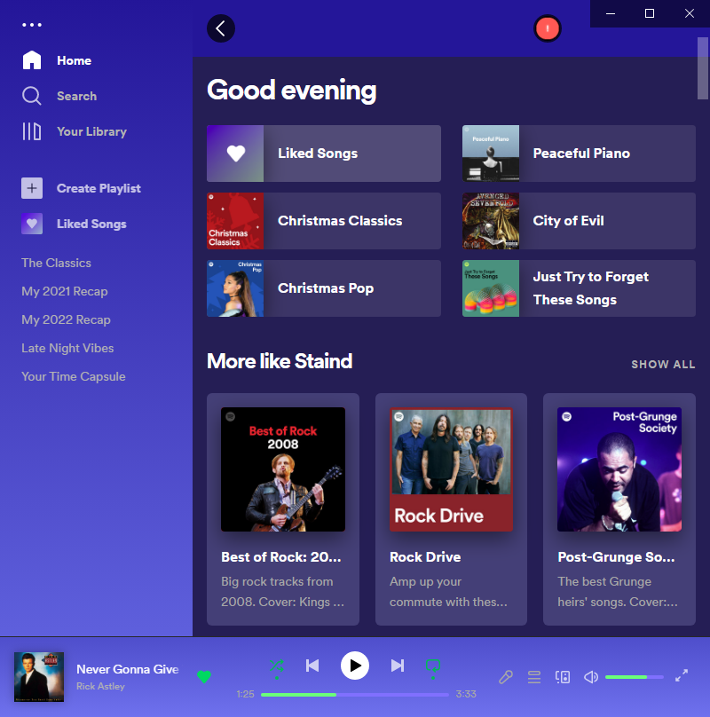

# Betterify
Open source Spotify modification currently only supporting themes. This is currently a novelty as there is no way (yet) to make it automatically trigger. This modification does not allow everything yet. You must have chrome installed.

Comes with 1 theme.
Fully Customizable.

# Usage
> ## Step 1
> Download the file [here](https://github.com/WaterFrontStudios/Betterify/blob/Code/Betterify.js).
> ## Step 2
> Enable debugging in Spotify. To do this right click on your Spotify shortcut and add ` --remote-debugging-port=9222` to the Target and click ok.
> ## Step 3
> Open devtools.
> > Open Google Chrome and go to `chrome://inspect`. Then wait for Spotify to show up, then click inspect. Drag the file you saved in Step 1 to the console input and press enter once the text shows up. Now it's done, close Chrome and enjoy your themed Spotify (until you close it)!

# Modifying
> ## Changing theme colors
> The variable names are pretty self explanitory, just modify them like they're CSS color properties.
> ## Found a bug or a better way to do something?
> Simply modify the file and create a pull request.
